# Sahayak — AI-Powered Gig Worker Empowerment Platform

**Smart India Hackathon 2026**
**Team:** Shreyansh Sachan · Ishwar · Aryan Gupta · Arushi Nayak · Tirth Patel · Ujjwal Pratap Singh

---

## Table of Contents

- [Project Overview](#project-overview)
- [Application Walkthrough](#application-walkthrough)
  - [Mobile App — Workers & Clients](#mobile-app--workers--clients)
  - [Web Portal — Federations & Government](#web-portal--federations--government)
- [Feature Deep-Dives](#feature-deep-dives)
  - [1. AI Voice Onboarding & Job Posting](#1-ai-voice-onboarding--job-posting)
  - [2. Intelligent Job Dispatch & Worker Matching](#2-intelligent-job-dispatch--worker-matching)
  - [3. Knowledge Graph & Skill Intelligence](#3-knowledge-graph--skill-intelligence)
  - [4. Job Demand & Availability Heatmaps](#4-job-demand--availability-heatmaps)
  - [5. Sisterhood Shield — Women's Safety](#5-sisterhood-shield--womens-safety)
  - [6. Payments, Payouts & Insurance](#6-payments-payouts--insurance)
  - [7. Federation System & Government Dashboard](#7-federation-system--government-dashboard)
  - [8. Multilingual i18n Support](#8-multilingual-i18n-support)
- [System Architecture](#system-architecture)
- [AI Pipeline Architecture](#ai-pipeline-architecture)
  - [Voice Conversation Agent (LangGraph)](#voice-conversation-agent-langgraph)
  - [Worker–Job Embedding Pipeline](#workerjob-embedding-pipeline)
  - [Safety Voice Note Triage](#safety-voice-note-triage)
- [Backend Architecture](#backend-architecture)
  - [API Routes Map](#api-routes-map)
  - [Data Models](#data-models)
  - [Background Dispatcher](#background-dispatcher)
- [Safety System — Detailed Logic](#safety-system--detailed-logic)
  - [Trust Score Mathematics](#trust-score-mathematics)
  - [Block Safety Scoring](#block-safety-scoring)
  - [Geohash-8 Spatial Tracking](#geohash-8-spatial-tracking)
- [Deployment & CI/CD](#deployment--cicd)
- [Tech Stack Summary](#tech-stack-summary)
- [Local Development Setup](#local-development-setup)
- [Testing](#testing)

---

## Project Overview

Sahayak is a production-grade, AI-first platform for **informal-sector gig workers** — connecting daily wage labourers, domestic workers, and micro-entrepreneurs with clients who need their services — while simultaneously providing a **real-time women's safety system** called the Sisterhood Shield.

The platform operates as three synchronized tiers:

1. **Mobile App** (React Native / Expo) — Workers find jobs via AI-matched recommendations and voice onboarding; clients post jobs through an AI voice conversation; everyone gets real-time safety through the Sisterhood Shield.
2. **Web Portal** (React / Vite) — Federations manage their member workers, insurance, and payouts; government officials verify federations and monitor city-wide job demand heatmaps and safety alerts.
3. **AI Service** (Python / FastAPI / LangGraph) — Multilingual voice agents for onboarding and job posting, powered by Gemini on Vertex AI.

The entire system is designed so that **AI is the first responder** — matching workers to jobs, triaging SOS voice notes, building knowledge graphs from feedback, and enabling voice-first interactions for users with low digital literacy.

---

## Application Walkthrough

### Mobile App — Workers & Clients

<p align="center">
  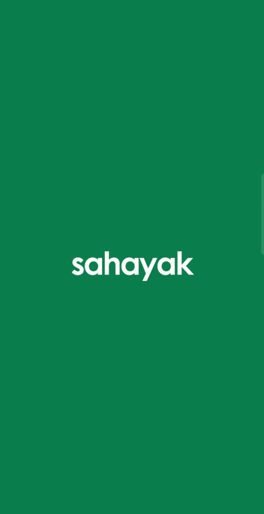
  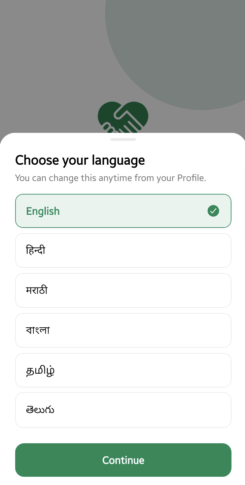
  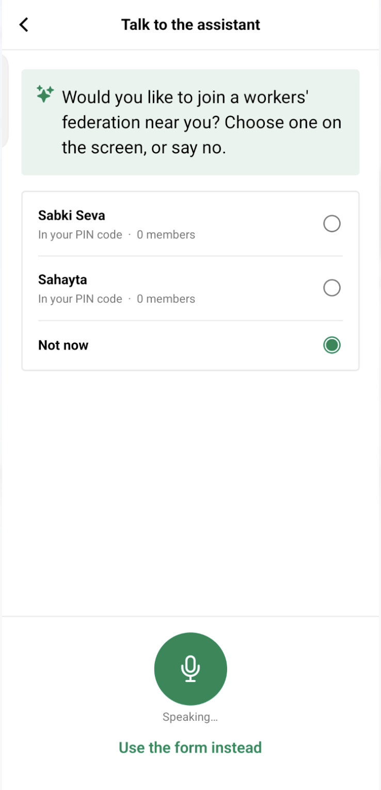
  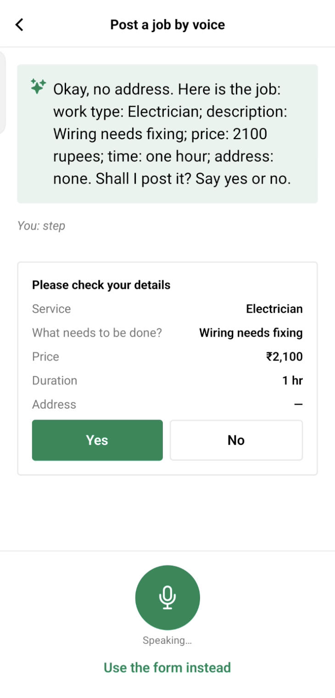
</p>
<p align="center">
  <em>Left to Right: App Landing · Language Selection · AI Voice Worker Onboarding · AI Voice Job Posting</em>
</p>

---

<p align="center">
  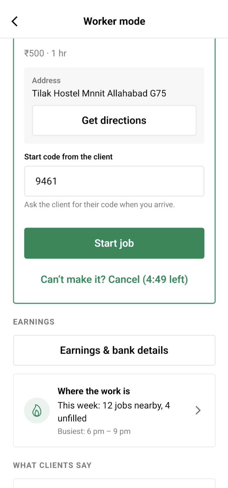
  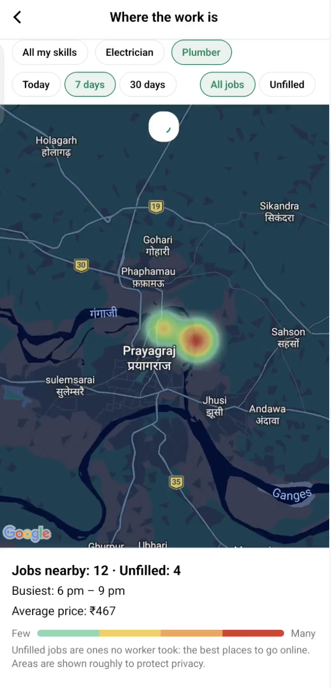
  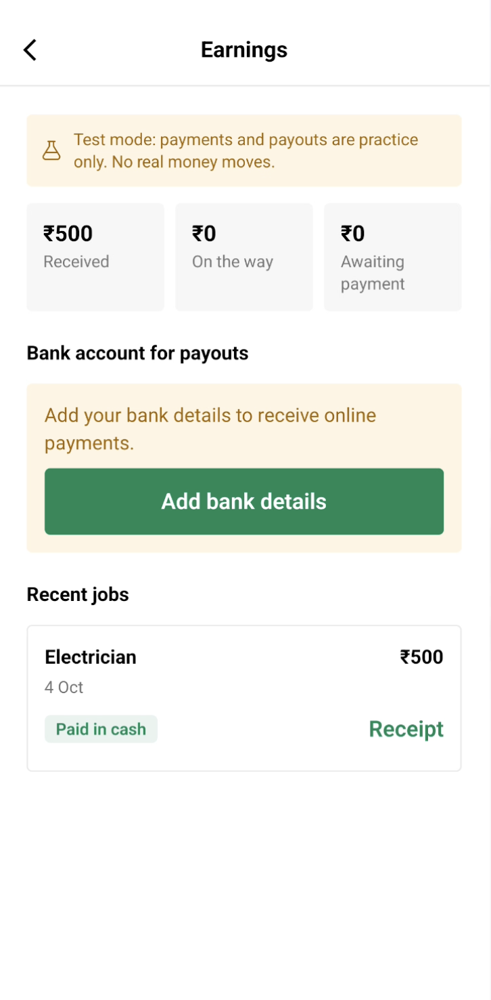
  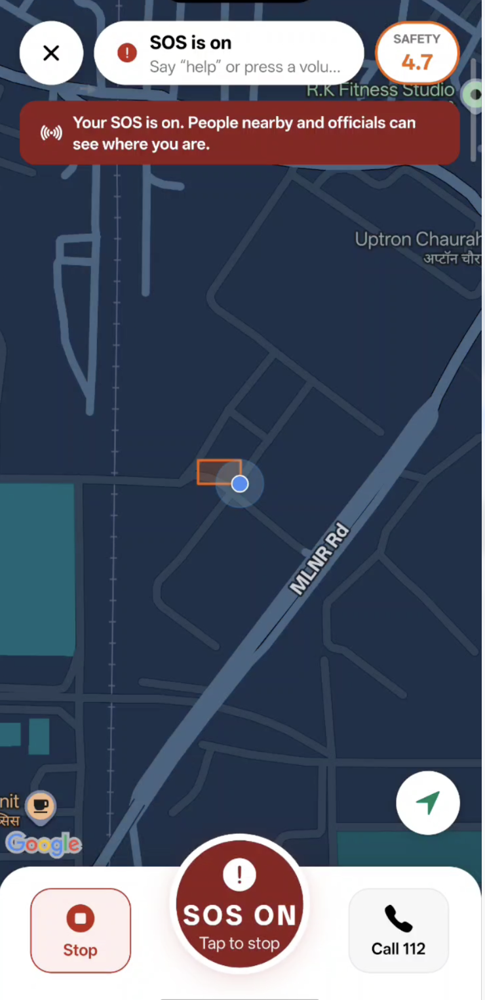
</p>
<p align="center">
  <em>Left to Right: Job Offer Acceptance · Demand Heatmap · Worker Earnings · Sisterhood Shield SOS</em>
</p>

---

<p align="center">
  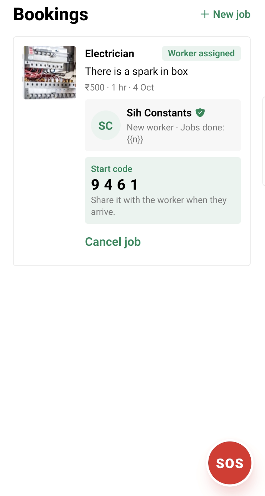
  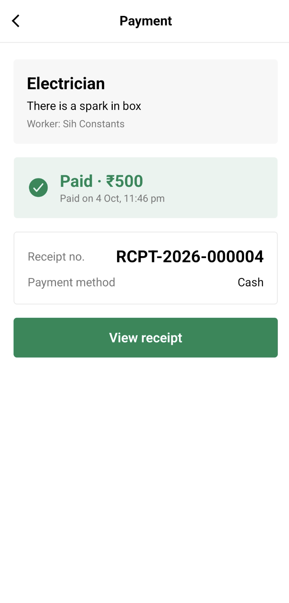
  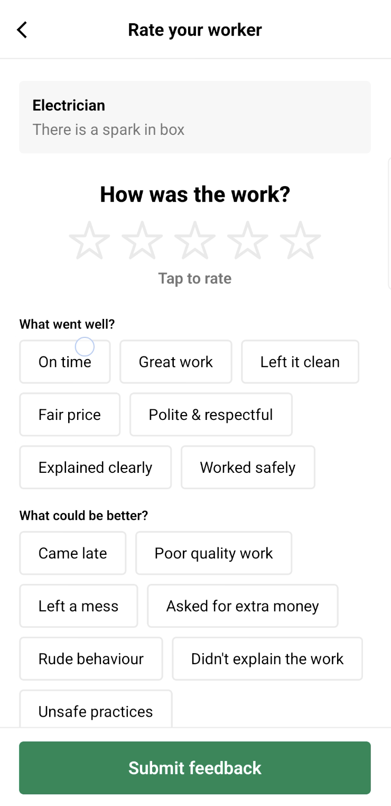
</p>
<p align="center">
  <em>Left to Right: Phone OTP Verification · Payment Flow · Post-Job Feedback & Rating</em>
</p>

---

### Web Portal — Federations & Government

<p align="center">
  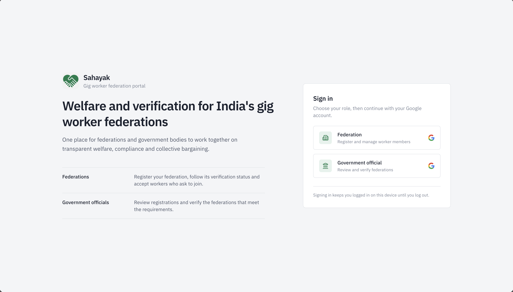
  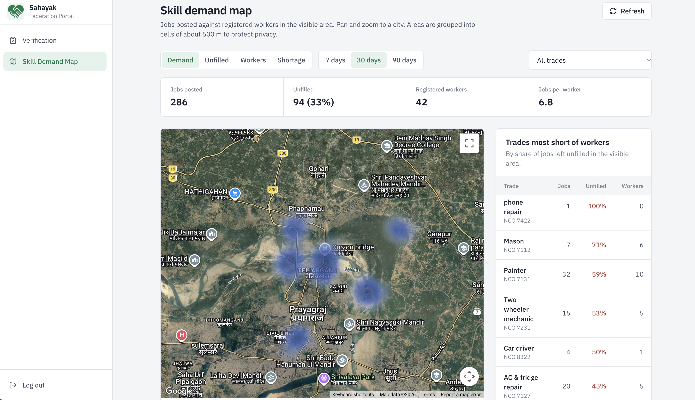
</p>
<p align="center">
  <em>Left: Web Portal Landing Page · Right: Government Dashboard with City-Wide Analytics</em>
</p>

---

<p align="center">
  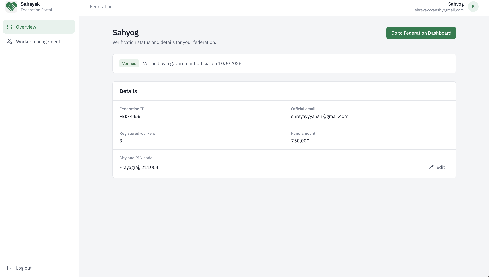
  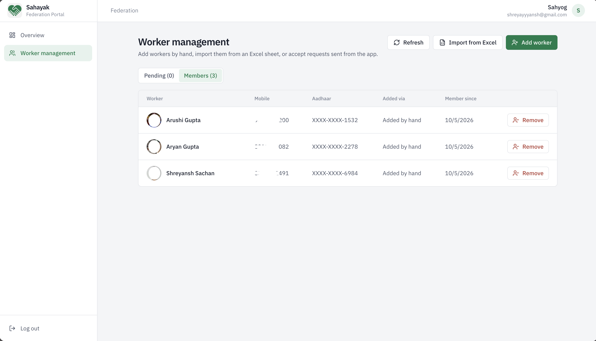
  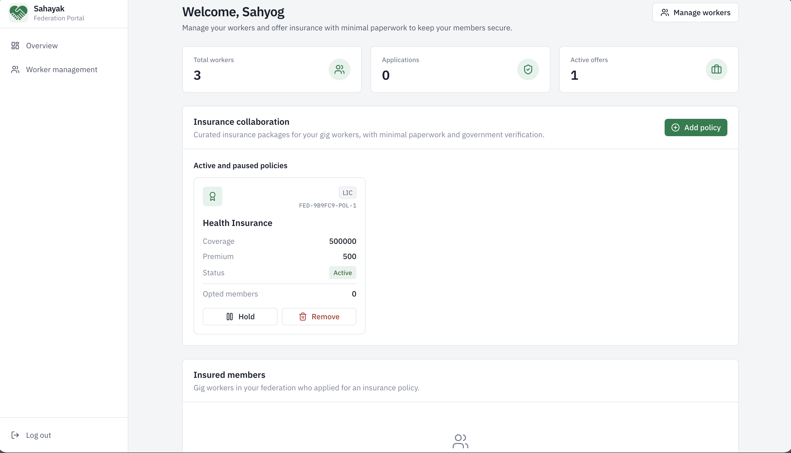
</p>
<p align="center">
  <em>Left to Right: Federation Dashboard · Member Management · Insurance Management</em>
</p>

---

<p align="center">
  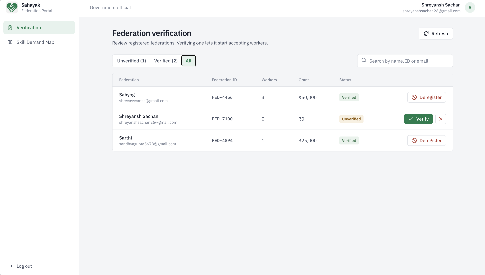
  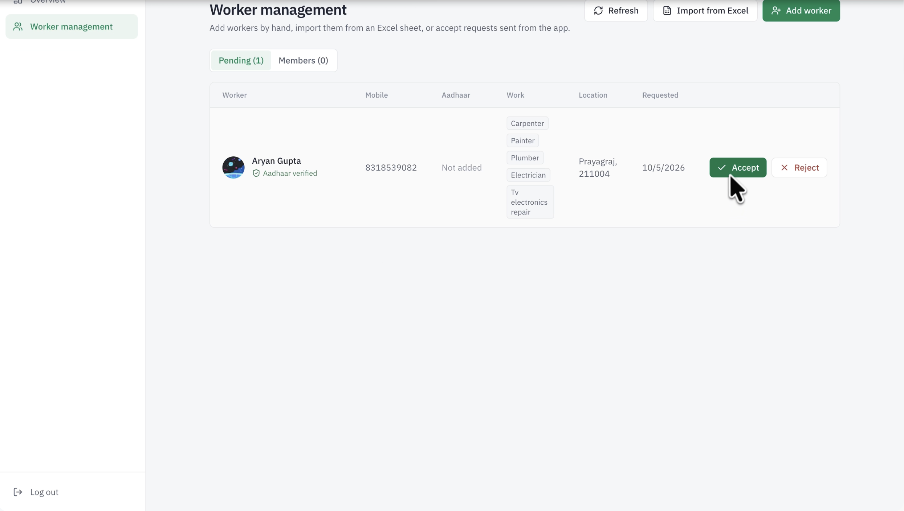
</p>
<p align="center">
  <em>Left: Government Federation Verification · Right: Worker Accepted into Federation</em>
</p>

---

## Feature Deep-Dives

### 1. AI Voice Onboarding & Job Posting

Sahayak's core innovation for accessibility: **workers and clients interact with the platform through a multilingual AI voice conversation**, not forms. This is critical for workers with low digital literacy.

**How It Works:**

The AI service runs two LangGraph state-machine flows — one for **worker onboarding** and one for **job posting** — each checkpointed per session in MongoDB. Every API call advances the conversation by one turn: the client speaks (transcript from on-device speech recognition), and the agent responds with the next thing to say.

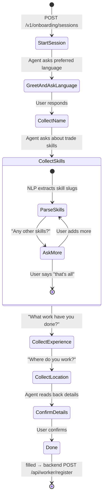
```mermaid
stateDiagram-v2
    [*] --> StartSession: POST /v1/onboarding/sessions
    StartSession --> GreetAndAskLanguage: Agent asks preferred language
    GreetAndAskLanguage --> CollectName: User responds
    CollectName --> CollectSkills: Agent asks about trade skills
    CollectSkills --> CollectExperience: "What work have you done?"
    CollectExperience --> CollectLocation: "Where do you work?"
    CollectLocation --> ConfirmDetails: Agent reads back details
    ConfirmDetails --> Done: User confirms
    Done --> [*]: filled → backend POST /api/worker/register

    state CollectSkills {
        [*] --> ParseSkills: NLP extracts skill slugs
        ParseSkills --> AskMore: "Any other skills?"
        AskMore --> ParseSkills: User adds more
        AskMore --> [*]: User says "that's all"
    }
```

**Key Design Decisions:**
- **Session checkpointing** — Conversations survive app crashes and network drops. MongoDB checkpoints (via `langgraph-checkpoint-mongodb`) persist the full graph state; in-memory fallback for local dev.
- **Language handling** — The agent auto-detects language from the user's first response using Gemini, and all subsequent prompts are in that language. Six languages supported: English, Hindi, Marathi, Bengali, Tamil, Telugu.
- **Skill extraction** — User descriptions like "I fix ACs and do plumbing" are parsed by Gemini into category slugs (`ac_repair`, `plumber`) using `rapidfuzz` fuzzy matching against the category catalogue, with `indic-transliteration` for romanised Hindi.
- **Token auth delegation** — The AI service validates every request by calling the Node backend's `/auth/me`, so it shares the same auth system without duplicating JWT secrets.

---

### 2. Intelligent Job Dispatch & Worker Matching

When a client posts a job, Sahayak's **multi-round dispatch system** finds the best available worker — not just the nearest one.

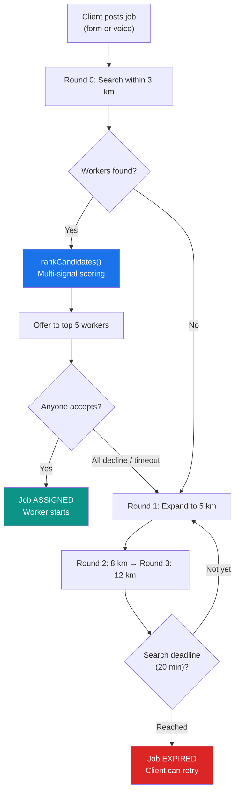
```mermaid
flowchart TD
    A["Client posts job<br/>(form or voice)"] --> B["Round 0: Search within 3 km"]
    B --> C{"Workers found?"}
    C -->|Yes| D["rankCandidates()<br/>Multi-signal scoring"]
    D --> E["Offer to top 5 workers"]
    E --> F{"Anyone accepts?"}
    F -->|Yes| G["Job ASSIGNED<br/>Worker starts"]
    F -->|All decline / timeout| H["Round 1: Expand to 5 km"]
    H --> I["Round 2: 8 km → Round 3: 12 km"]
    I --> J{"Search deadline<br/>(20 min)?"}
    J -->|Reached| K["Job EXPIRED<br/>Client can retry"]
    J -->|Not yet| H
    C -->|No| H

    style D fill:#1a73e8,color:#fff
    style G fill:#0d9488,color:#fff
    style K fill:#dc2626,color:#fff
```

**The Ranking Algorithm — 7 Weighted Signals:**

Every candidate worker is scored on a composite of signals, each normalised to 0–1:

| Signal | Weight | Source |
|---|---|---|
| **Distance** | 22% | Haversine from `$geoNear` — linear falloff to 0 at 10 km |
| **Rating** | 18% | Bayesian average: `(sum + prior × priorWeight) / (count + priorWeight)` with prior 4.0 |
| **Relevance** | 15% | Cosine similarity: job embedding vs. worker's trade vector (see [Embedding Pipeline](#workerjob-embedding-pipeline)) |
| **Affinity** | 13% | Client↔worker history: past ratings, repeat hires, stored as an `Affinity` record |
| **Reliability** | 13% | Acceptance rate (Bayesian-averaged), weighted by recent performance |
| **Experience** | 10% | Completed jobs in this category, capped at 20 for full score |
| **Traits** | 9% | Knowledge graph: worker's trait scores vs. what this client values (praised/criticized) |

**Fairness Adjustments:**
- **Newcomer boost** (+5%): Workers with < 3 completed jobs get a visibility boost.
- **Today penalty** (−3% per job, max −12%): Spreads work across workers; nobody monopolises all the day's jobs.

---

### 3. Knowledge Graph & Skill Intelligence

After every completed job, the client leaves **structured feedback**: a star rating, praised/criticized trait chips (e.g., "punctual", "rough work"), and a free-text comment. This feedback feeds a **worker knowledge graph**.

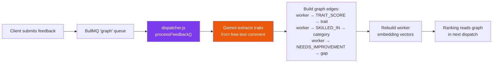
```mermaid
flowchart LR
    A["Client submits feedback"] --> B["BullMQ 'graph' queue"]
    B --> C["dispatcher.js<br/>processFeedback()"]
    C --> D["Gemini extracts traits<br/>from free-text comment"]
    D --> E["Build graph edges:<br/>worker → TRAIT_SCORE → trait<br/>worker → SKILLED_IN → category<br/>worker → NEEDS_IMPROVEMENT → gap"]
    E --> F["Rebuild worker<br/>embedding vectors"]
    F --> G["Ranking reads graph<br/>in next dispatch"]

    style C fill:#7c3aed,color:#fff
    style D fill:#ea580c,color:#fff
```

**Graph Edge Types:**
- `TRAIT_SCORE` — Bayesian-averaged trait score (−1 to +1) with recency-weighted evidence. Trait prior of 2 prevents a single bad review from tanking a score.
- `SKILLED_IN` — Experience level per trade, from completed job count.
- `NEEDS_IMPROVEMENT` — Automatically created when a trait score drops below −0.2 with ≥ 2 criticisms, or when average rating in a trade is ≤ 3.0 with ≥ 2 ratings.
- `SPECIALTY` — What a worker is known for within a trade, extracted by Gemini from feedback patterns.

**Skill Gap → Government Scheme Matching:**
Workers with `NEEDS_IMPROVEMENT` edges are matched to relevant government upskilling schemes, surfaced in the app's benefits tab.

---

### 4. Job Demand & Availability Heatmaps

Privacy-preserving heatmaps for workers, clients, and government officials.

**Privacy Model:** Individual job/worker coordinates are **never exposed**. All locations are bucketed into ~500m grid cells (`CELL_DEG = 0.005°`), and cells with fewer than `HEATMAP_MIN_COUNT` (default 2) items are dropped — preventing identification of any single person.

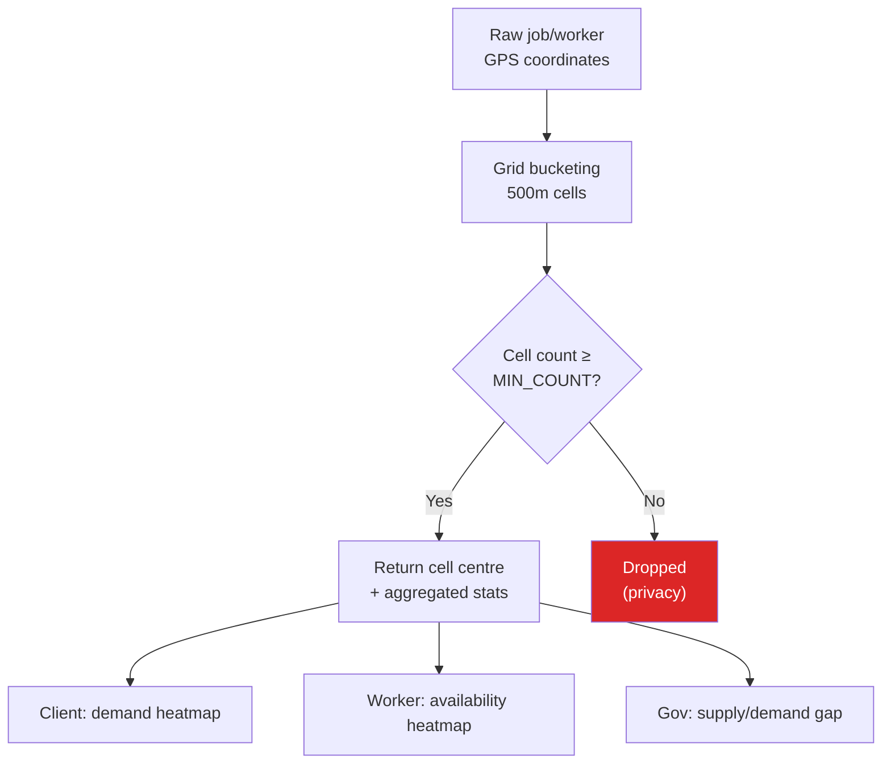
```mermaid
flowchart TD
    A["Raw job/worker<br/>GPS coordinates"] --> B["Grid bucketing<br/>500m cells"]
    B --> C{"Cell count ≥<br/>MIN_COUNT?"}
    C -->|Yes| D["Return cell centre<br/>+ aggregated stats"]
    C -->|No| E["Dropped<br/>(privacy)"]
    D --> F["Client: demand heatmap"]
    D --> G["Worker: availability heatmap"]
    D --> H["Gov: supply/demand gap"]

    style E fill:#dc2626,color:#fff
```

**Three Heatmap Views:**
| View | Audience | Data |
|---|---|---|
| **Demand** | Workers | Job count, unfilled jobs, busiest hours, avg price per cell |
| **Availability** | Clients | Online worker count per cell, typical wait time |
| **Government** | Officials | Supply/demand gap: cells where jobs go unfilled vs. where workers idle |

**Caching:** Heatmaps are identical for everyone querying the same area, so they're cached for 60 seconds with a 500-entry LRU cache. Coordinates are rounded to 2 decimal places (~1 km) to maximize cache hits.

---

### 5. Sisterhood Shield — Women's Safety

The Sisterhood Shield is a **real-time women's safety system** that activates from the red SOS button above the app's tab bar. While active, the phone continuously reports its position, and the server tracks safety scores across the city at ~38×19 metre resolution.

**SOS Trigger Mechanisms — Five Ways to Call for Help:**

| Trigger | How | Code |
|---|---|---|
| **Button** | Tap the red SOS button on the shield screen | `sisterhood.js` |
| **Call 112** | Tap "Call 112" — logs an SOS and dials emergency | `callEmergency()` in `shield.js` |
| **Voice keyword** | Say "help", "bachao", "बचाओ", "SOS" — continuous speech recognition via `expo-speech-recognition` | `useSosTriggers.js` — keywords in 6 languages |
| **Volume key** | Press volume up/down 3× within 2 seconds | `addVolumeListener()` in `useSosTriggers.js` |
| **Notification** | Tap the shield's persistent notification while screen is off | Expo Notifications action |

**What Happens on SOS Activation:**

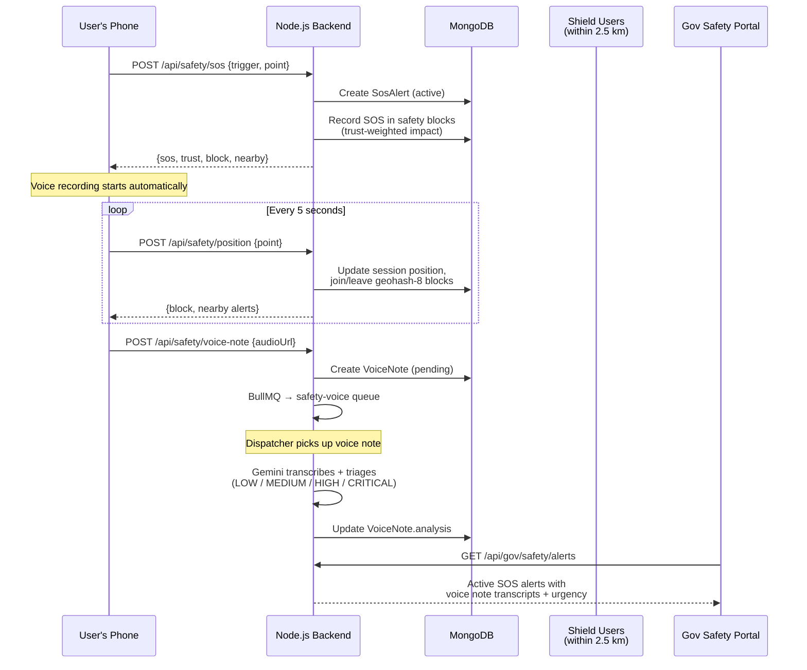
```mermaid
sequenceDiagram
    participant Phone as User's Phone
    participant Backend as Node.js Backend
    participant DB as MongoDB
    participant Nearby as Shield Users<br/>(within 2.5 km)
    participant Portal as Gov Safety Portal

    Phone->>Backend: POST /api/safety/sos {trigger, point}
    Backend->>DB: Create SosAlert (active)
    Backend->>DB: Record SOS in safety blocks<br/>(trust-weighted impact)
    Backend-->>Phone: {sos, trust, block, nearby}

    Note over Phone: Voice recording starts automatically

    loop Every 5 seconds
        Phone->>Backend: POST /api/safety/position {point}
        Backend->>DB: Update session position,<br/>join/leave geohash-8 blocks
        Backend-->>Phone: {block, nearby alerts}
    end

    Phone->>Backend: POST /api/safety/voice-note {audioUrl}
    Backend->>DB: Create VoiceNote (pending)
    Backend->>Backend: BullMQ → safety-voice queue

    Note over Backend: Dispatcher picks up voice note
    Backend->>Backend: Gemini transcribes + triages<br/>(LOW / MEDIUM / HIGH / CRITICAL)
    Backend->>DB: Update VoiceNote.analysis

    Portal->>Backend: GET /api/gov/safety/alerts
    Backend-->>Portal: Active SOS alerts with<br/>voice note transcripts + urgency
```

**Voice Note Triage by Gemini:**
During an active SOS, the app records voice notes and uploads them to Cloudinary. The dispatcher's `safety-voice` BullMQ queue sends each note to Gemini for transcription and urgency classification:
- **LOW** — Background noise, no distress indicators
- **MEDIUM** — Verbal conflict, raised voices
- **HIGH** — Screaming, calls for help
- **CRITICAL** — Physical assault indicators, weapon mentions

Previous notes in the session are included as context, so urgency can escalate across notes.

---

### 6. Payments, Payouts & Insurance

**Payment Flow:**

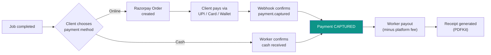
```mermaid
flowchart LR
    A["Job completed"] --> B{"Client chooses<br/>payment method"}
    B -->|Online| C["Razorpay Order<br/>created"]
    C --> D["Client pays via<br/>UPI / Card / Wallet"]
    D --> E["Webhook confirms<br/>payment.captured"]
    E --> F["Payment CAPTURED"]
    B -->|Cash| G["Worker confirms<br/>cash received"]
    G --> F
    F --> H["Worker payout<br/>(minus platform fee)"]
    H --> I["Receipt generated<br/>(PDFKit)"]

    style F fill:#0d9488,color:#fff
```

**Key Implementation Details:**
- **Platform fee** — Configurable via `PLATFORM_FEE_PERCENT` (default 0%), deducted before worker payout.
- **Payout modes** — `simulated` (records without moving money, for dev) or `route` (Razorpay Route linked account transfers).
- **Security hold** — Payouts wait `PAYOUT_CHANGE_HOLD_HOURS` (default 24h) after bank details change, preventing fraud.
- **Receipt numbers** — Sequential, from a MongoDB `Counter` model. Generated as PDFs via `pdfkit`.

**Insurance:**
Federations can enrol their workers in insurance packages. The app's benefits tab shows available and active coverage, with the federation managing premiums and claims.

---

### 7. Federation System & Government Dashboard

**Federations** are registered organisations (unions, cooperatives, NGOs) that vouch for groups of workers. The web portal provides full lifecycle management:

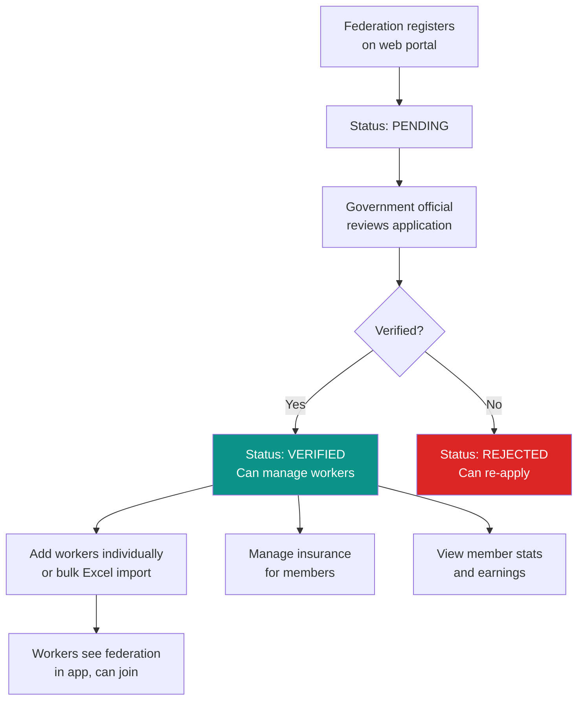
```mermaid
flowchart TD
    A["Federation registers<br/>on web portal"] --> B["Status: PENDING"]
    B --> C["Government official<br/>reviews application"]
    C --> D{"Verified?"}
    D -->|Yes| E["Status: VERIFIED<br/>Can manage workers"]
    D -->|No| F["Status: REJECTED<br/>Can re-apply"]
    E --> G["Add workers individually<br/>or bulk Excel import"]
    G --> H["Workers see federation<br/>in app, can join"]
    E --> I["Manage insurance<br/>for members"]
    E --> J["View member stats<br/>and earnings"]

    style E fill:#0d9488,color:#fff
    style F fill:#dc2626,color:#fff
```

**Government Dashboard Features:**
- **Federation verification queue** — Review pending applications with document inspection.
- **City-wide demand heatmap** — See where jobs go unfilled and where workers are underutilised (gov-specific 7/30/90-day windows).
- **Safety alerts portal** — Real-time SOS alerts on a map, with voice note transcripts and urgency levels.

---

### 8. Multilingual i18n Support

The entire app is localised in **6 languages**: English, Hindi, Marathi, Bengali, Tamil, and Telugu.

- **i18n framework** — `i18next` + `react-i18next` with namespace-structured JSON locale files.
- **CI enforcement** — `scripts/check-i18n.mjs` validates that all locale files have identical key trees.
- **AI agent language** — Voice agents detect and respond in the user's language automatically.
- **SOS keywords** — Distress keywords in all 6 languages: "help", "SOS", "bachao/बचाओ", "वाचवा", "বাঁচাও", "காப்பாற்று", "కాపాడండి".

---

## System Architecture

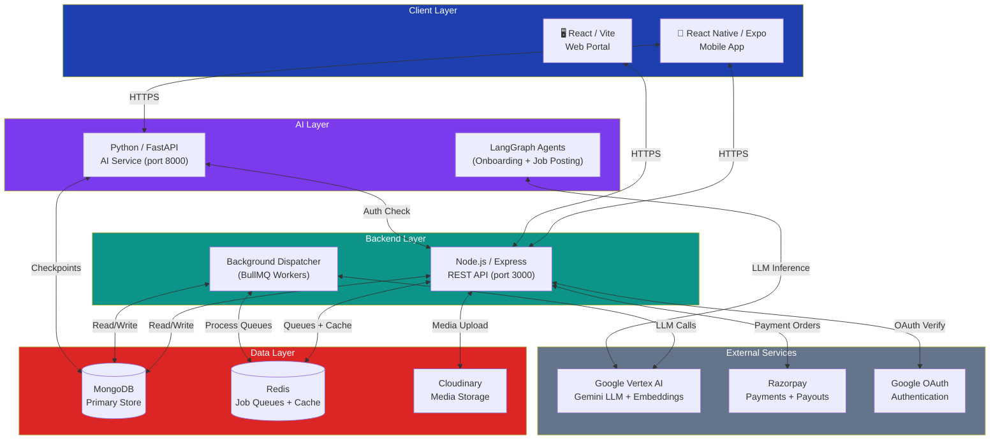
```mermaid
graph TB
    subgraph CLIENTS["Client Layer"]
        RN["📱 React Native / Expo<br/>Mobile App"]
        WEB["🖥️ React / Vite<br/>Web Portal"]
    end

    subgraph BACKEND["Backend Layer"]
        API["Node.js / Express<br/>REST API (port 3000)"]
        DISP["Background Dispatcher<br/>(BullMQ Workers)"]
    end

    subgraph AI["AI Layer"]
        FAST["Python / FastAPI<br/>AI Service (port 8000)"]
        LANG["LangGraph Agents<br/>(Onboarding + Job Posting)"]
    end

    subgraph DATA["Data Layer"]
        MONGO[("MongoDB<br/>Primary Store")]
        REDIS[("Redis<br/>Job Queues + Cache")]
        CLOUD["Cloudinary<br/>Media Storage"]
    end

    subgraph EXTERNAL["External Services"]
        VERTEX["Google Vertex AI<br/>Gemini LLM + Embeddings"]
        RAZOR["Razorpay<br/>Payments + Payouts"]
        GAUTH["Google OAuth<br/>Authentication"]
    end

    RN <-->|HTTPS| API
    WEB <-->|HTTPS| API
    RN <-->|HTTPS| FAST
    API <-->|Read/Write| MONGO
    API <-->|Queues + Cache| REDIS
    API <-->|Media Upload| CLOUD
    DISP <-->|Process Queues| REDIS
    DISP <-->|Read/Write| MONGO
    DISP <-->|LLM Calls| VERTEX
    FAST <-->|Auth Check| API
    FAST <-->|Checkpoints| MONGO
    LANG <-->|LLM Inference| VERTEX
    API <-->|Payment Orders| RAZOR
    API <-->|OAuth Verify| GAUTH

    style CLIENTS fill:#1e40af,color:#fff
    style BACKEND fill:#0d9488,color:#fff
    style AI fill:#7c3aed,color:#fff
    style DATA fill:#dc2626,color:#fff
    style EXTERNAL fill:#64748b,color:#fff
```

---

## AI Pipeline Architecture

### Voice Conversation Agent (LangGraph)

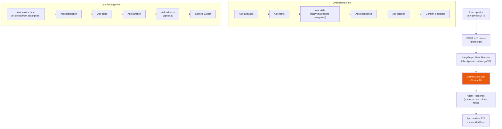
```mermaid
flowchart TD
    A["User speaks<br/>(on-device STT)"] --> B["POST /v1/.../turns<br/>{transcript}"]
    B --> C["LangGraph State Machine<br/>(checkpointed in MongoDB)"]
    C --> D["Gemini 3.8 Flash<br/>(Vertex AI)"]
    D --> E["Agent Response:<br/>{speak, ui, step, done, filled}"]
    E --> F["App renders TTS<br/>+ auto-filled form"]

    subgraph Onboarding Flow
        O1["Ask language"] --> O2["Ask name"]
        O2 --> O3["Ask skills<br/>(fuzzy-matched to categories)"]
        O3 --> O4["Ask experience"]
        O4 --> O5["Ask location"]
        O5 --> O6["Confirm & register"]
    end

    subgraph Job Posting Flow
        J1["Ask service type<br/>(or detect from description)"] --> J2["Ask description"]
        J2 --> J3["Ask price"]
        J3 --> J4["Ask duration"]
        J4 --> J5["Ask address<br/>(optional)"]
        J5 --> J6["Confirm & post"]
    end

    style D fill:#ea580c,color:#fff
```

### Worker–Job Embedding Pipeline

Every semantic match in Sahayak — job-to-worker, scheme-to-gap — is powered by **Gemini embedding vectors** (768 dimensions):

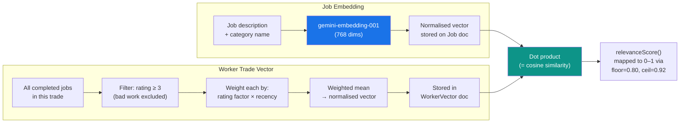
```mermaid
flowchart LR
    subgraph JOB["Job Embedding"]
        J1["Job description<br/>+ category name"] --> J2["gemini-embedding-001<br/>(768 dims)"]
        J2 --> J3["Normalised vector<br/>stored on Job doc"]
    end

    subgraph WORKER["Worker Trade Vector"]
        W1["All completed jobs<br/>in this trade"] --> W2["Filter: rating ≥ 3<br/>(bad work excluded)"]
        W2 --> W3["Weight each by:<br/>rating factor × recency"]
        W3 --> W4["Weighted mean<br/>→ normalised vector"]
        W4 --> W5["Stored in<br/>WorkerVector doc"]
    end

    J3 --> SCORE["Dot product<br/>(= cosine similarity)"]
    W5 --> SCORE
    SCORE --> RANK["relevanceScore()<br/>mapped to 0–1 via<br/>floor=0.80, ceil=0.92"]

    style J2 fill:#1a73e8,color:#fff
    style SCORE fill:#0d9488,color:#fff
```

**How the relevance score works:**
- Similarity ≤ 0.80 → score 0 (completely different work)
- Similarity ≥ 0.92 → score 1 (identical type of job)
- Linear interpolation in between
- Evidence prior: with `n` jobs behind a vector, trust it `n / (n + 3)` — new workers get a neutral 0.5

**Storage optimisation:** Vectors are stored as `Float32Array` Buffers in MongoDB (3 KB per vector at 768 dims), roughly half the size of a BSON array of doubles.

### Safety Voice Note Triage

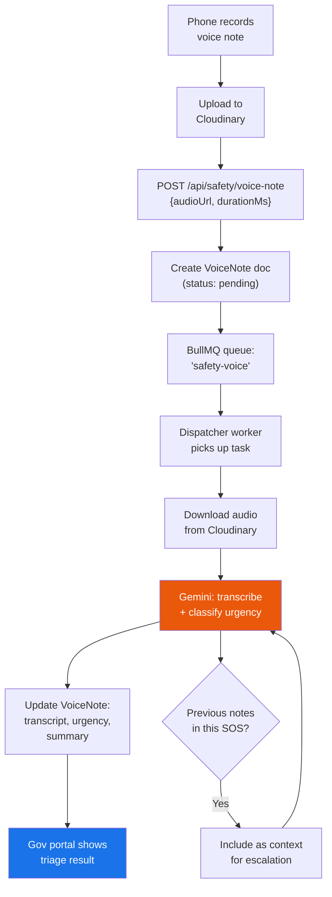
```mermaid
flowchart TD
    A["Phone records<br/>voice note"] --> B["Upload to<br/>Cloudinary"]
    B --> C["POST /api/safety/voice-note<br/>{audioUrl, durationMs}"]
    C --> D["Create VoiceNote doc<br/>(status: pending)"]
    D --> E["BullMQ queue:<br/>'safety-voice'"]
    E --> F["Dispatcher worker<br/>picks up task"]
    F --> G["Download audio<br/>from Cloudinary"]
    G --> H["Gemini: transcribe<br/>+ classify urgency"]
    H --> I["Update VoiceNote:<br/>transcript, urgency,<br/>summary"]
    I --> J["Gov portal shows<br/>triage result"]

    H --> K{"Previous notes<br/>in this SOS?"}
    K -->|Yes| L["Include as context<br/>for escalation"]
    L --> H

    style H fill:#ea580c,color:#fff
    style J fill:#1a73e8,color:#fff
```

---

## Backend Architecture

### API Routes Map

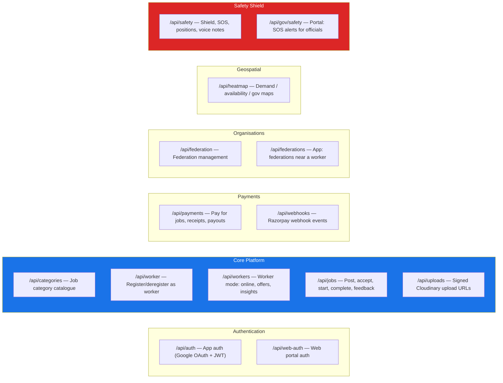
```mermaid
graph LR
    subgraph AUTH["Authentication"]
        A1["/api/auth — App auth (Google OAuth + JWT)"]
        A2["/api/web-auth — Web portal auth"]
    end

    subgraph CORE["Core Platform"]
        C1["/api/categories — Job category catalogue"]
        C2["/api/worker — Register/deregister as worker"]
        C3["/api/workers — Worker mode: online, offers, insights"]
        C4["/api/jobs — Post, accept, start, complete, feedback"]
        C5["/api/uploads — Signed Cloudinary upload URLs"]
    end

    subgraph MONEY["Payments"]
        M1["/api/payments — Pay for jobs, receipts, payouts"]
        M2["/api/webhooks — Razorpay webhook events"]
    end

    subgraph ORG["Organisations"]
        O1["/api/federation — Federation management"]
        O2["/api/federations — App: federations near a worker"]
    end

    subgraph GEO["Geospatial"]
        G1["/api/heatmap — Demand / availability / gov maps"]
    end

    subgraph SAFETY["Safety Shield"]
        S1["/api/safety — Shield, SOS, positions, voice notes"]
        S2["/api/gov/safety — Portal: SOS alerts for officials"]
    end

    style SAFETY fill:#dc2626,color:#fff
    style CORE fill:#1a73e8,color:#fff
```

### Data Models

| Model | Purpose | Key Fields |
|---|---|---|
| `User` | All authenticated users | `phone`, `name`, `role`, `aadhaarVerified`, `safety.trustScore` |
| `WorkerProfile` | Worker's live state | `location` (2dsphere), `skills[]`, `isOnline`, `currentJob`, `maxDistanceKm` |
| `WorkerStats` | Aggregated worker metrics | `completedJobs`, `totalRating`, `acceptanceRate`, `jobsToday` |
| `WorkerVector` | Embedding per trade | `worker`, `category`, `embedding` (Buffer), `jobCount` |
| `Job` | Full job lifecycle | `client`, `category`, `price`, `location`, `status`, `dispatch.offers[]` |
| `Feedback` | Post-job rating + traits | `rating`, `praised[]`, `criticized[]`, `comment`, `extracted` |
| `GraphEdge` | Knowledge graph edges | `fromType`, `fromId`, `rel`, `toType`, `toId`, `weight`, `evidence` |
| `Affinity` | Client↔worker relationship | `client`, `worker`, `category`, `jobCount`, `avgRating` |
| `Payment` | Payment records | `job`, `method`, `status`, `amountPaise`, `razorpayOrderId` |
| `Federation` | Registered organisations | `name`, `status` (PENDING/VERIFIED/REJECTED), `govOfficial` |
| `SafetySession` | Active shield session | `user`, `position`, `activeAlert`, `mode` (STATIONARY/MOVING) |
| `SafetyBlock` | ~38×19m city block | `geohash`, `activeUsers[]`, `sosCount`, `weightedImpact` |
| `SosAlert` | Active/resolved SOS | `user`, `trigger`, `location`, `status`, `outcome`, `path[]` |
| `VoiceNote` | SOS voice recording | `audioUrl`, `alert`, `analysis.{transcript, urgency, summary}` |

### Background Dispatcher

The dispatcher (`npm run dispatcher`) is a separate process running three BullMQ workers in parallel:

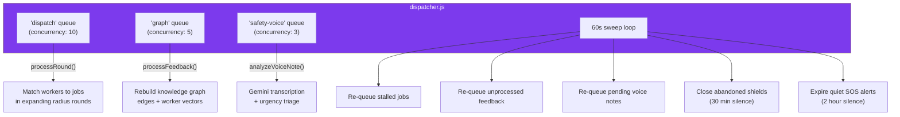
```mermaid
flowchart TD
    subgraph DISPATCHER["dispatcher.js"]
        D1["'dispatch' queue<br/>(concurrency: 10)"]
        D2["'graph' queue<br/>(concurrency: 5)"]
        D3["'safety-voice' queue<br/>(concurrency: 3)"]
        SWEEP["60s sweep loop"]
    end

    D1 --> |"processRound()"| JOB["Match workers to jobs<br/>in expanding radius rounds"]
    D2 --> |"processFeedback()"| GRAPH["Rebuild knowledge graph<br/>edges + worker vectors"]
    D3 --> |"analyzeVoiceNote()"| VOICE["Gemini transcription<br/>+ urgency triage"]
    SWEEP --> S1["Re-queue stalled jobs"]
    SWEEP --> S2["Re-queue unprocessed feedback"]
    SWEEP --> S3["Re-queue pending voice notes"]
    SWEEP --> S4["Close abandoned shields<br/>(30 min silence)"]
    SWEEP --> S5["Expire quiet SOS alerts<br/>(2 hour silence)"]

    style DISPATCHER fill:#7c3aed,color:#fff
```

**Cloud Run compatibility:** When `K_SERVICE` is set, the dispatcher starts an HTTP health endpoint on `$PORT` — Cloud Run requires an active listener to keep the container alive.

**Idle optimisation:** BullMQ's `drainDelay` is set to 30 seconds (vs. default 5) and stalled-check interval to 2 minutes — cutting idle Redis commands for hosted Redis (Upstash) billing.

---

## Safety System — Detailed Logic

### Trust Score Mathematics

Every user starts with trust **5.0** (range 1–10). Trust determines how much weight their SOS carries on the safety map.

```
After false alarm:    trust = max(1.0, trust × e^(−0.4))
                      streak resets to 0, false count +1

After real emergency: trust = min(10.0, trust + 1.0)

After safe walk:      streak += 1
                      Every 5th safe walk: trust += 0.5
                        • Cap: 7.5 (normal) or 10.0 (Aadhaar-verified)
                        • Streak resets to 0
                      Safe walk = shield open ≥ 10 min without SOS
```

### Block Safety Scoring

The city is divided into geohash-8 blocks (~38 × 19 metres). Each block carries a **safety score** (1–10, where 10 = safest):

```
SOS weight   = trustScore × timeOfDayMultiplier
                where multiplier = 1.5  (22:00–04:59)
                                   0.7  (08:00–18:59)
                                   1.0  (otherwise)

Impact decay = impact × e^(−0.01 × hours_since_last_sos)
                (half-life ≈ 70 hours)

Block score  = max(1, 10 × e^(−0.05 × current_impact))
```

The decay ensures old incidents fade. Night-time reports weigh 50% more. The timezone is configurable via `SAFETY_TIMEZONE` (default `Asia/Kolkata`).

### Geohash-8 Spatial Tracking

While the shield is open, the user is counted as present in a small set of geohash-8 blocks around them:

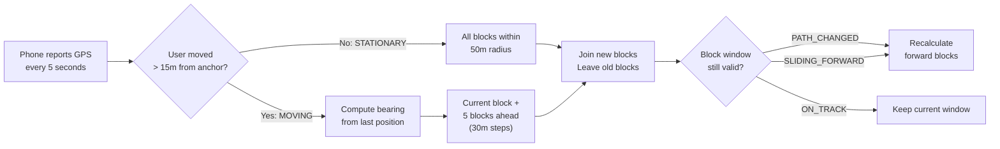
```mermaid
flowchart LR
    A["Phone reports GPS<br/>every 5 seconds"] --> B{"User moved<br/>> 15m from anchor?"}
    B -->|No: STATIONARY| C["All blocks within<br/>50m radius"]
    B -->|Yes: MOVING| D["Compute bearing<br/>from last position"]
    D --> E["Current block +<br/>5 blocks ahead<br/>(30m steps)"]

    C --> F["Join new blocks<br/>Leave old blocks"]
    E --> F

    F --> G{"Block window<br/>still valid?"}
    G -->|PATH_CHANGED| H["Recalculate<br/>forward blocks"]
    G -->|SLIDING_FORWARD| H
    G -->|ON_TRACK| I["Keep current window"]
```

**Nearby SOS Alerts:** Shield users within a 2.5 km radius see active SOS alerts from others, enabling community-based rapid response.

---

## Deployment & CI/CD

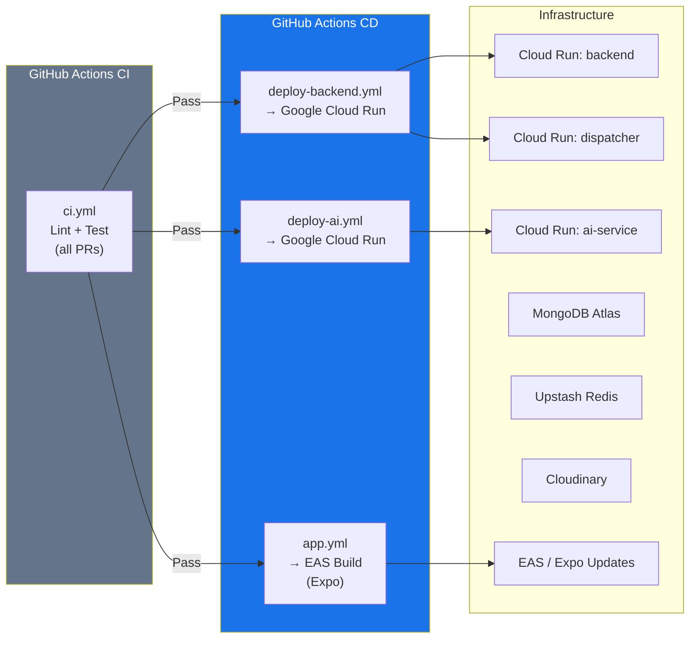
```mermaid
flowchart LR
    subgraph CI["GitHub Actions CI"]
        T1["ci.yml<br/>Lint + Test<br/>(all PRs)"]
    end

    subgraph CD["GitHub Actions CD"]
        T2["deploy-backend.yml<br/>→ Google Cloud Run"]
        T3["deploy-ai.yml<br/>→ Google Cloud Run"]
        T4["app.yml<br/>→ EAS Build<br/>(Expo)"]
    end

    subgraph INFRA["Infrastructure"]
        CR1["Cloud Run: backend"]
        CR2["Cloud Run: dispatcher"]
        CR3["Cloud Run: ai-service"]
        MDB["MongoDB Atlas"]
        UPS["Upstash Redis"]
        CLO["Cloudinary"]
        EAS["EAS / Expo Updates"]
    end

    T1 -->|Pass| T2
    T1 -->|Pass| T3
    T1 -->|Pass| T4
    T2 --> CR1
    T2 --> CR2
    T3 --> CR3
    T4 --> EAS

    style CI fill:#64748b,color:#fff
    style CD fill:#1a73e8,color:#fff
```

**Docker Compose** (`docker-compose.yml`) for self-hosted deployment runs three services:
- `backend` — Node API server (port 3000)
- `dispatcher` — Background queue processor
- `redis` — Job queue (localhost-only, never publicly exposed)

**EAS Build:** The mobile app uses Expo Application Services for cloud builds. OTA updates via `expo-updates` with fingerprint-based `runtimeVersion`.

---

## Tech Stack Summary

| Layer | Technology | Purpose |
|---|---|---|
| **Mobile App** | React Native, Expo SDK 57, Expo Router | Cross-platform mobile with background location, speech recognition, notifications |
| **Web Portal** | React 19, Vite 8, Tailwind CSS 4 | Federation and government admin dashboard |
| **Backend API** | Node.js, Express 4 | REST API, auth, business logic, event-driven processing |
| **AI Service** | Python, FastAPI, LangGraph, LangChain | Voice agents, NLP, conversation state machines |
| **LLM** | Google Gemini 3.8 Flash (Vertex AI) | Text generation, trait extraction, voice note triage |
| **Embeddings** | Gemini Embedding 001 (768d) | Worker profile and job description vector encoding |
| **Primary Database** | MongoDB (Mongoose ODM) | Documents: users, jobs, feedback, safety, payments |
| **Job Queues** | Redis + BullMQ | Dispatch rounds, graph processing, voice note analysis |
| **Payments** | Razorpay (Orders + Routes) | Online payment, worker payouts, webhook verification |
| **Media Storage** | Cloudinary | Job photos, profile images, voice note audio |
| **Auth** | Google OAuth 2.0 + JWT | Mobile: Google Sign-In; Web: `@react-oauth/google` |
| **Maps** | Google Maps SDK (Android), Apple Maps (iOS) | Heatmaps, shield map, job location |
| **Geospatial** | ngeohash | Precision-6/8 spatial indexing for safety and heatmaps |
| **Speech** | expo-speech-recognition | On-device STT for voice onboarding and SOS keywords |
| **i18n** | i18next + react-i18next | 6 languages: en, hi, mr, bn, ta, te |
| **CI/CD** | GitHub Actions, EAS Build | Automated testing, Cloud Run deploy, Expo OTA updates |
| **Containerisation** | Docker, Docker Compose | Backend + dispatcher + Redis orchestration |

---

## Local Development Setup

### Prerequisites
- Node.js 18+, Python 3.11+, Redis (or `docker compose up -d redis`)
- A Google Cloud project with the Vertex AI API enabled (optional — the app works without AI, just no voice agents or embedding features)

### 1. Backend

```bash
cd backend
cp .env.example .env          # fill in MongoDB URI, Razorpay keys, etc.
npm install
npm run seed:categories       # load job category catalogue (safe to re-run)
npm run dev                   # → localhost:3000
npm run dispatcher            # separate terminal — queue processing
```

### 2. AI Service

```bash
cd ai-service
python3.12 -m venv .venv
source .venv/bin/activate
pip install -r requirements.txt
cp .env.example .env          # set GOOGLE_CLOUD_PROJECT, key path, NODE_API_URL
uvicorn app.main:app --reload --host 0.0.0.0 --port 8000
```

### 3. Web Portal

```bash
cd client
cp .env.example .env          # set API URL, Google OAuth client ID
npm install
npm run dev                   # → localhost:5173
```

### 4. Mobile App

```bash
cd client-native
cp .env.example .env          # set EXPO_PUBLIC_API_BASE_URL, GOOGLE_MAPS_API_KEY
npm install
npx expo run:android          # or: npx eas-cli@latest build --profile development
```

> **Note:** The app uses native modules (location, speech, maps), so it needs a **development build** — Expo Go won't work. Set `EXPO_PUBLIC_API_BASE_URL` and `EXPO_PUBLIC_AI_BASE_URL` to reach the backend and AI service from the phone.

### USB Debugging (Android)

```bash
cd client-native
npm run usb                   # adb reverse for ports 8081 + 3000
```

---

## Testing

```bash
# Backend — API tests with in-memory MongoDB
cd backend && npm test

# AI Service — unit + conversation tests (no network / key needed)
cd ai-service && .venv/bin/pytest

# AI Service — one real Vertex AI call (needs key)
cd ai-service && pytest -m live

# Mobile app — i18n key parity + lint
cd client-native && npm run test:i18n && npm run check:i18n && npx expo lint

# Web portal — lint + production build validation
cd client && npm run lint && npm run build
```

---

<p align="center">
  <em>Sahayak — Empowering India's informal workforce with AI. Every worker matched intelligently. Every woman protected in real-time.</em>
</p>
