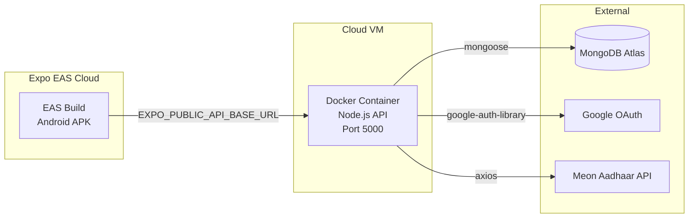

# 🚀 SIH Project – Deployment Guide

## Architecture Overview



---

## Part 1: Backend Deployment (Docker on Cloud VM)

### Files Created/Modified

| File | Purpose |
|------|---------|
| [`Dockerfile`](file:///e:/sih/SIH-project/backend/Dockerfile) | Multi-stage production build |
| [`.dockerignore`](file:///e:/sih/SIH-project/backend/.dockerignore) | Excludes node_modules, .env from image |
| [`docker-compose.yml`](file:///e:/sih/SIH-project/docker-compose.yml) | Orchestrates the backend service |
| [`server.js`](file:///e:/sih/SIH-project/backend/server.js) | Updated: binds to `0.0.0.0` + graceful shutdown |
| [`.env.example`](file:///e:/sih/SIH-project/backend/.env.example) | Template for environment variables |

### Quick Start (Local)

```bash
# From project root
docker compose up --build
```

The backend will be live at `http://localhost:5000`. Verify:
```bash
curl http://localhost:5000/api/health
# → {"status":"ok","message":"SIH Backend is running"}
```

### Deploy to a Cloud VM

```bash
# 1. SSH into your VM
ssh user@your-vm-ip

# 2. Clone the repo
git clone <your-repo-url> && cd SIH-project

# 3. Create the .env file
cp backend/.env.example backend/.env
nano backend/.env   # fill in real values

# 4. Build & run
docker compose up -d --build

# 5. Verify
curl http://localhost:5000/api/health
```

### Useful Docker Commands

```bash
docker compose logs -f backend    # tail logs
docker compose restart backend    # restart
docker compose down               # stop & remove
docker compose up -d --build      # rebuild & restart
```

---

## Part 2: APK Build (Expo EAS)

### Prerequisites

```bash
# Install EAS CLI globally
npm install -g eas-cli

# Login to your Expo account
eas login
```

### Update Client `.env`

Before building, update [`client-native/.env`](file:///e:/sih/SIH-project/client-native/.env):

```env
# Point to your deployed backend
EXPO_PUBLIC_API_BASE_URL=https://your-server-domain.com/api
```

### Build the APK

```bash
cd client-native

# Build an installable APK (preview profile)
eas build --platform android --profile preview-apk
```

> [!IMPORTANT]
> The `preview-apk` profile in [`eas.json`](file:///e:/sih/SIH-project/client-native/eas.json) is configured to produce an `.apk` file (not `.aab`), so it can be installed directly on devices without going through Google Play.

### EAS Build Profiles

| Profile | Output | Use Case |
|---------|--------|----------|
| `development` | Dev client | Local development with hot reload |
| `preview` | AAB | Internal testing (needs Play Console) |
| **`preview-apk`** | **APK** | **Direct device install / cloud deploy** |
| `production` | AAB | Play Store release |

### Download & Install

After the build completes, EAS gives you a download URL:
```
✔ Build finished: https://expo.dev/artifacts/eas/xxx.apk
```

Download it and install on any Android device via `adb`:
```bash
adb install path/to/sih-connect.apk
```

---

## Part 3: Production Checklist

- [ ] **Backend `.env`** — all values filled, `JWT_SECRET` is a strong random string
- [ ] **MongoDB Atlas** — IP whitelist includes your cloud VM's IP
- [ ] **Google OAuth** — authorized redirect URIs updated for production domain
- [ ] **Client `.env`** — `EXPO_PUBLIC_API_BASE_URL` points to the deployed backend
- [ ] **HTTPS** — set up a reverse proxy (Nginx/Caddy) with SSL in front of Docker
- [ ] **Domain** — point your domain to the cloud VM IP
- [ ] **Firewall** — only ports 80, 443, and 22 (SSH) open

---

## Key Changes Made to Existing Code

### [`server.js`](file:///e:/sih/SIH-project/backend/server.js)

```diff
-    const PORT = process.env.PORT || 5000;
-    app.listen(PORT, () => {
-      console.log(`🚀 Server running on port ${PORT}`);
+const PORT = process.env.PORT || 5000;
+const HOST = '0.0.0.0'; // Required for Docker
+    const server = app.listen(PORT, HOST, () => {
+      console.log(`🚀 Server running on ${HOST}:${PORT}`);
     });
+    // Graceful shutdown for Docker SIGTERM
+    process.on('SIGTERM', () => shutdown('SIGTERM'));
+    process.on('SIGINT', () => shutdown('SIGINT'));
```

### [`eas.json`](file:///e:/sih/SIH-project/client-native/eas.json)

```diff
+    "preview-apk": {
+      "distribution": "internal",
+      "android": {
+        "buildType": "apk"
+      }
+    },
```
